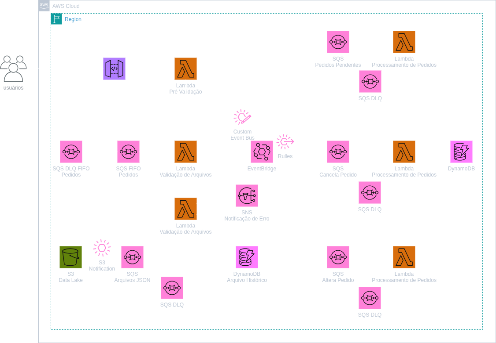

# 🚀 Sistema Serverless de Processamento de Pedidos – AWS

Este projeto implementa uma arquitetura serverless na AWS para processar pedidos com duas formas de entrada: tempo real via API e arquivos em lote via S3. A arquitetura foi pensada para **baixo custo**, **alta escalabilidade** e **modularidade**.

---

## 🧩 Diagrama da Arquitetura



---

## 🔧 Tecnologias e Serviços AWS

- Amazon API Gateway (REST)
- AWS Lambda (validações e processamento)
- Amazon SQS FIFO (fila principal)
- Amazon S3 (entrada em lote)
- Amazon DynamoDB (dados principais + histórico)
- Amazon EventBridge (Custom Bus)
- Amazon SNS (notificações)
- AWS CloudFormation (Infraestrutura como Código)

---

## 📥 Fluxo do Sistema

### Entrada 1: API REST (tempo real)
1. Usuário envia pedido via API Gateway.
2. Lambda de **pré-validação** verifica dados básicos.
3. Pedido é enviado para **SQS FIFO**.
4. Lambda de **validação profunda** consome da fila e publica evento no **EventBridge**.
5. EventBridge direciona para outras filas: alteração, cancelamento, pendente.
6. Outras Lambdas consomem e salvam no **DynamoDB**.

### Entrada 2: Arquivo JSON no S3 (lote)
1. Arquivo enviado ao **bucket S3**.
2. Evento dispara Lambda que valida o lote.
3. Dados válidos são:
   - Enviados para SQS FIFO (mesma fila principal)
   - Armazenados em DynamoDB Histórico
   - Erros disparam notificação via SNS

---

## 📁 Estrutura de Pastas

```plaintext
infra/               # Templates CloudFormation
lambdas/             # Código das funções Lambda (Python)
docs/                # Diagramas e documentação visual
scripts/             # Deploy/teste (opcional)
